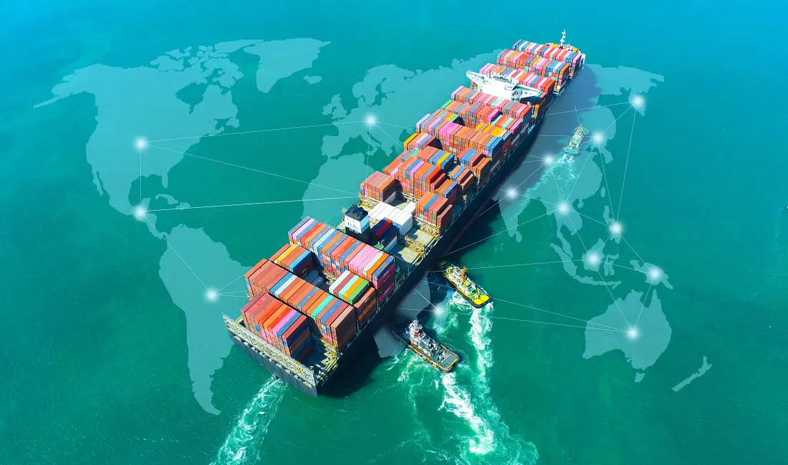
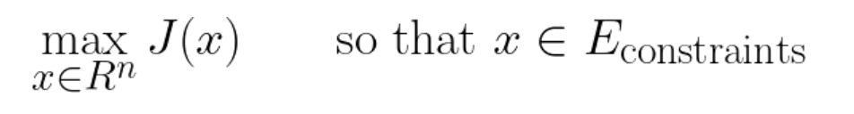
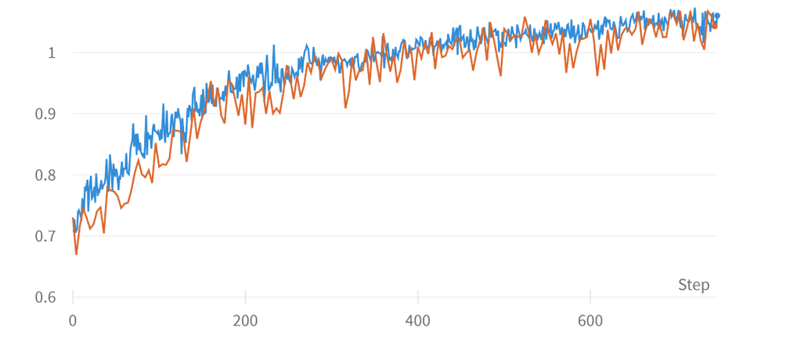

# RL with GNN for a blackbox combinatorial constrained graph optimization problem

  

This is a presentation of the work I conducted during my R&D internship at InstaDeep. The goal was to find how to assign a set of vessels to routes relying a set of ports. You can find more information in the [medium article](https://medium.com/instadeep/deep-reinforcement-learning-for-network-design-in-marine-transportation-c3e31a1aba0) I wrote about it. This can be categorized as a blackbox combinatorial optimization problem.

An interesting point is to explain why RL can be used as a very unique and relevant way to tackle those kind of problems.

## Blackbox combinatorial constrained optimization problems

Blackbox optimization problems are problems where the objective function is not known. The only way to evaluate the objective function is to run the algorithm on a given input and observe the output. 

The goal can be described as such :

  

The algorithms used for solving those kind of problems are called metaheuristics. They are often based on the idea of exploring the search space and exploiting the best solutions found so far.

## Why use RL for such a problem ?

The choice of using RL for such kind of problems can appear kind of surprising, as it's not the obvious way to go, and a metaheuristic algorithm such as Genetic Algorithms or Simulated Annealing will perform better on such a problem.

In fact, we use RL not for the metric performance but for the practical performance in inference during the practical use of the algorithm.

Indeed, with metaheuristics for each new problem, it will requires to train a new algorithm from scratch. This is not the case with RL, as the RL agent is trained to learn a policy that can be applied to any problem of the same type, during what we call inference in Machine Learning.

## Architectures

The agent used was PPO. The model was using a GNN architecture for exploiting the notion of graph in the problem. It was also using Permutation Invariant mecanisms such as min/max/mean for treating batch of graphs representing a non constant representation of the instances of problems. This allowed the model to be able to generalize to unseen instances of the problem.

## Results and conclusion

After training on variations of a certain topology, that is inspired by the worldwide current marine transportation network, the expert-normalized metric reached 1+, which means the RL agent was able to generalize networks of a better quality than the default ones, whose the topology was inspired by the current marine transportation network.

  

    <em>Expert-normalized performance of PPO agent for Network Design</em>

This is a promising result because it means that RL can be used for blackbox combinatorial constrained optimization problems, with the advantage of being able to generalize to unseen instances of the problem and instantly used for inference.
